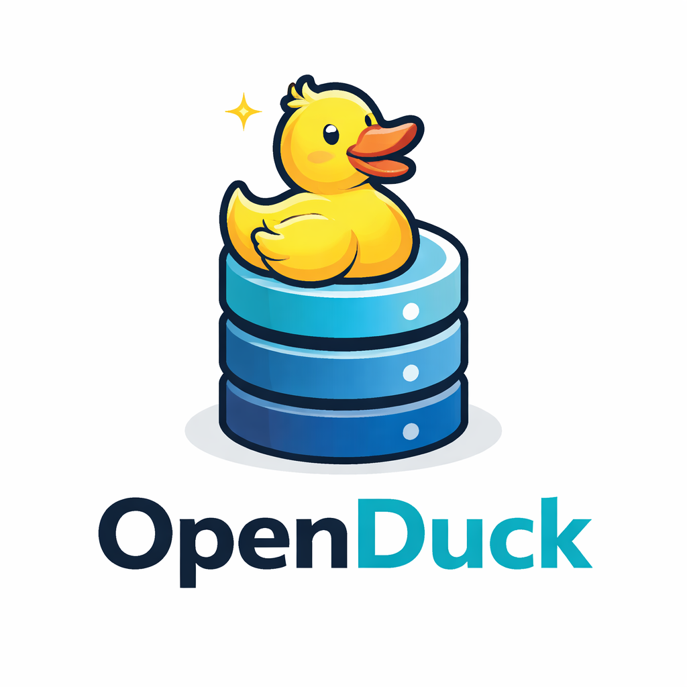

<p align="center">
  
</p>
# OpenDuck 

**OpenDuck Server** is an open-source, self-hosted DuckDB Flight server for remote analytics.  
It allows Python, Java, and BI tools to query Parquet files and object storage (S3-compatible) efficiently, without relying on a managed cloud service.

---

## Description

OpenDuck Server provides a lightweight server layer on top of DuckDB, exposing **remote SQL execution via Apache Arrow Flight**.  
It is designed for environments where data must stay on-premises, on your object storage, or in edge deployments, while enabling analytics clients to access it efficiently.

Key features:

- Remote execution of DuckDB queries
- Arrow Flight protocol for high-performance columnar streaming
- Python client support (PyArrow Flight)
- Java/JDBC client support for BI tools
- Parquet file and S3-compatible object storage access
- Single-tenant deployments
- Token-based authentication for secure access

---

## What OpenDuck Server **is**

- A **self-hosted server** for DuckDB
- A **remote query engine**, not a full database platform
- Designed for **read-only analytics workloads**
- Lightweight, minimal, and focused on transparency and control
- Ideal for environments that cannot or do not want to send data to managed services

---

## What OpenDuck Server **is NOT**

- A replacement for DuckDB itself
- A SaaS or managed service
- A multi-tenant analytics platform
- A metadata catalog or lakehouse
- A query scheduler, workflow engine, or visualization tool
- A platform for transactional workloads (OLTP)

---

## Expectations

Users of OpenDuck Server can expect:

- **Secure access**: Only authorized users with valid tokens can create a DuckDB session.
- **Efficient streaming**: Arrow Flight ensures large query results are streamed efficiently to clients.
- **Python-first access**: Python clients can connect directly using PyArrow Flight.
- **JDBC support**: Java and BI tools can query through the JDBC driver.
- **Parquet and S3 support**: Query files directly on disk or in object storage without moving data.
- **Stability and simplicity**: Server focuses on a small, stable API for analytics workloads.

---

## Getting Started

### Python Client Example
```python
import pyarrow.flight as flight

client = flight.FlightClient("grpc://localhost:8815")

sql = "SELECT 42 AS answer"
descriptor = flight.FlightDescriptor.for_command(sql.encode())
info = client.get_flight_info(descriptor)

reader = client.do_get(info.endpoints[0].ticket)
table = reader.read_all()
print(table.to_pandas())

